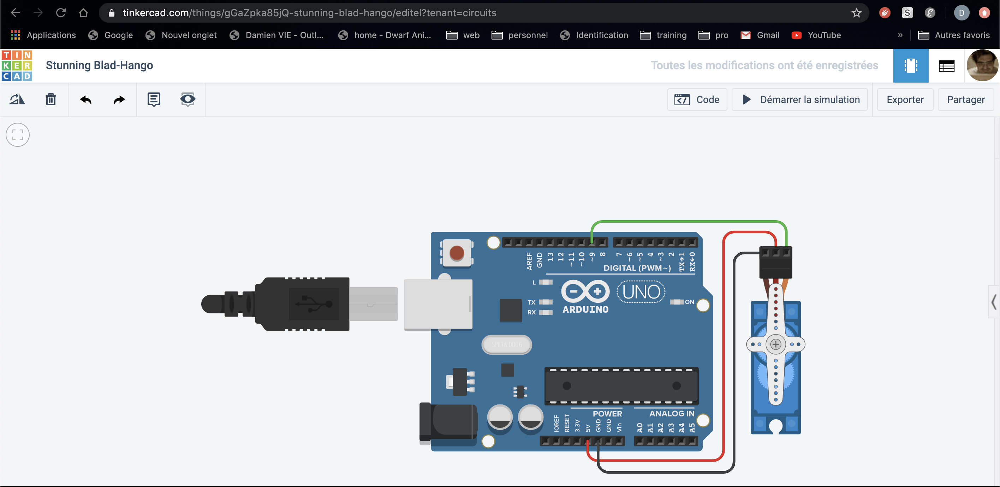

# driveServoMotorWithMaya
Drive servo motor with autodeskMaya and Arduino

## Ressources :
__main.ino__ : is the code to upload inside the Arduino
__mayaToArduino.py__ : is the code the execute inside maya.
__test_terminal.py__ : test unitaire, can be execute inside one terminal in python for test without open Maya
__scene_test.ma__ : scene ready to use the codes mayaToArduino.py

## How it work :
Connect teh servoMotor and the arduino with the draw.
Upload the code main.ino to the arduino.
Keep the arduino connected with computer.
Since maya open one new thread python who read the attribute of one target object, the result is send to the arduino with the serial port.

## Montage :

